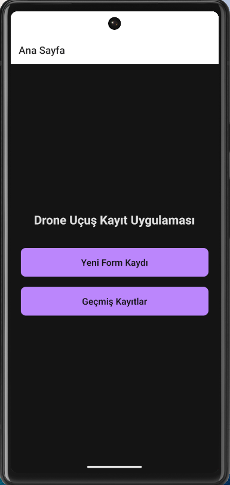
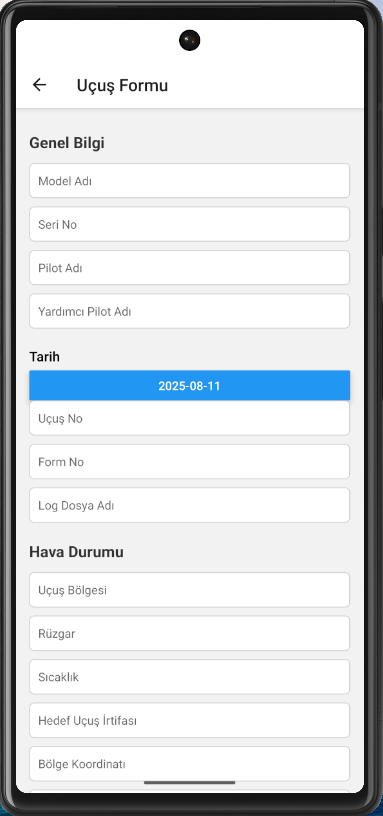
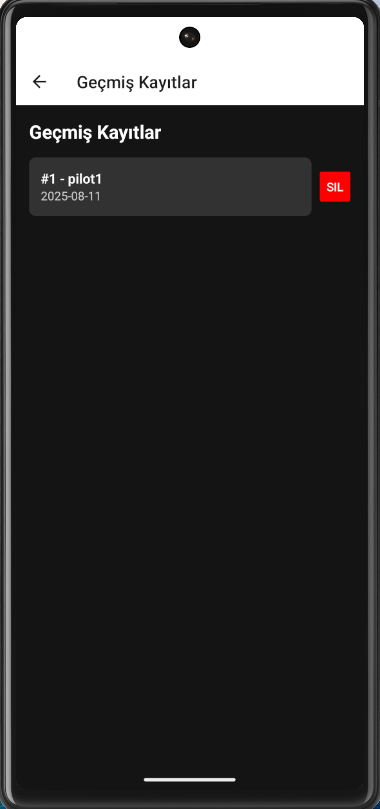
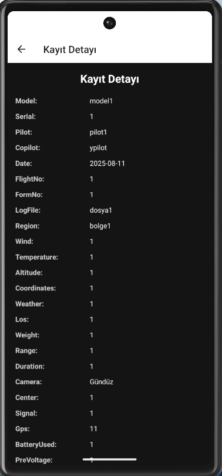

# 🚀 DroneFlightFormApp

**DroneFlightFormApp**, drone uçuş bilgilerini kaydetmek, geçmiş kayıtları görüntülemek ve yönetmek için geliştirilmiş bir mobil uygulamadır.  
Uygulama **React Native** ile geliştirilmiş frontend ve **Node.js + Express.js + MongoDB (Docker)** tabanlı backend’den oluşur.

---

## 📌 İçindekiler
- [Proje Hakkında](#-proje-hakkında)
- [Özellikler](#-özellikler)
- [Kullanılan Teknolojiler](#-kullanılan-teknolojiler)
- [Kurulum](#-kurulum)
  - [Backend Kurulumu (drone-backend)](#1-backend-kurulumu-drone-backend)
  - [Frontend Kurulumu (DroneFlightFormApp)](#2-frontend-kurulumu-droneflightformapp)
- [Kullanım](#-kullanım)
- [API Endpointleri](#-api-endpointleri)
- [Ekran Görselleri](#-ekran-görselleri)
- [Karşılaşılan Sorunlar ve Çözümleri](#-karşılaşılan-sorunlar-ve-çözümleri)

---

##  Proje Hakkında
Bu proje, drone uçuş kayıtlarının **hem cihaz üzerinde (AsyncStorage)** hem de **sunucu üzerinde (MongoDB)** saklanmasını amaçlar.  
Kullanıcılar uygulama üzerinden uçuş formu doldurabilir, kayıtları listeleyebilir ve silebilir.  
Backend tarafı **Docker** ile yönetilen bir **MongoDB** veritabanına bağlanır.

---

##  Özellikler
- 📋 Drone uçuş kayıt formu doldurma
- 💾 Yerel depolama (AsyncStorage)
- 🌐 Sunucuya kayıt (MongoDB + Express.js)
- 📜 Geçmiş kayıtları listeleme
- 🗑 Kayıt silme özelliği
- 📱 Kullanıcı dostu mobil arayüz

---

##  Kullanılan Teknolojiler

### Frontend
- React Native
- TypeScript
- AsyncStorage
- React Navigation
- DateTimePicker
- Picker (react-native-picker)

### Backend
- Node.js
- Express.js
- MongoDB (Docker ile)
- Mongoose
- CORS

---

##  Kurulum

### 1. Backend Kurulumu (drone-backend)
```bash
# Proje dizinine gir
cd drone-backend

# Gerekli paketleri yükle
npm install

# Docker ile MongoDB, Backend ve Mongo Express başlat
docker-compose up -d

# Backend server başlat (Docker kullanıyorsanız bu gerekli değil)
npm start
```

**docker-compose.yml içeriği:**
```yaml
version: '3.8'

services:
  mongo:
    image: mongo
    container_name: drone-mongo
    ports:
      - "27017:27017"
    volumes:
      - mongo-data:/data/db

  backend:
    build: .
    ports:
      - "3000:3000"
    depends_on:
      - mongo
    environment:
      - MONGO_URL=mongodb://mongo:27017/droneDB
    restart: unless-stopped

  mongo-express:
    image: mongo-express
    container_name: drone-mongo-express
    restart: unless-stopped
    ports:
      - "8082:8081" # 8081 iç port, 8082 dış port (host'tan erişim için)
    environment:
      - ME_CONFIG_MONGODB_SERVER=mongo
      - ME_CONFIG_MONGODB_PORT=27017
      - ME_CONFIG_MONGODB_ENABLE_ADMIN=true
      - ME_CONFIG_BASICAUTH_USERNAME=admin
      - ME_CONFIG_BASICAUTH_PASSWORD=1234
    depends_on:
      - mongo

volumes:
  mongo-data:
```

---

### 2. Frontend Kurulumu (DroneFlightFormApp)
```bash
# Proje dizinine gir
cd DroneFlightFormApp

# Gerekli paketleri yükle
npm install

# Uygulamayı çalıştır
npm start

# Android için:
npm run android
```

> Android emülatörde çalışırken `10.0.2.2` kullanın.

---

## Kullanım
1. Uygulamayı başlatın.
2. **"Yeni Kayıt"** ekranına gidin.
3. Drone uçuş formunu doldurun.
4. Kaydı hem yerel belleğe hem MongoDB’ye kaydedin.
5. **"Geçmiş"** ekranından kayıtları görüntüleyin veya silin.
6. MongoDB kayıtlarını tarayıcıdan görüntülemek için:  
   ```
   http://localhost:8082
   ```
   Kullanıcı adı: `admin`  
   Şifre: `1234`

---

## 🌐 API Endpointleri
| Method | Endpoint      | Açıklama                  |
|--------|--------------|---------------------------|
| GET    | /records     | Tüm uçuş kayıtlarını getir |
| POST   | /records     | Yeni uçuş kaydı ekle       |
| DELETE | /records/:id | Belirtilen kaydı sil       |

**POST /records Örnek JSON**
```json
{
  "pilotName": "Ahmet Yılmaz",
  "droneModel": "DJI Mavic Air 2",
  "flightDate": "2025-08-04T14:30:00Z",
  "flightLocation": "İstanbul",
  "notes": "Test uçuşu başarılı."
}
```

---

## 🖼 Ekran Görselleri
> Buraya proje ekran görüntülerini ekleyebilirsiniz:
```


              (docs/form-ekrani2.png)


```

---

## ⚠ Karşılaşılan Sorunlar ve Çözümleri
- **MongoDB Bağlantı Hatası:**  
  Docker konteynerinin çalıştığından emin olun. `docker ps` komutu ile kontrol edin.
  
- **Cihazda API'ye erişim sorunu:**  
  Android emülatörde `localhost` yerine `10.0.2.2` kullanılmalıdır.

- **AsyncStorage veri çekme sorunu:**  
  `useEffect` içerisinde asenkron veri çekme fonksiyonu kullanın.

---
